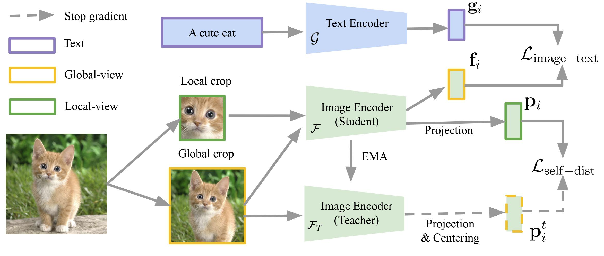

# SILC: Improving Vision Language Pretraining with Self-Distillation

**by
[Muhammad Ferjad Naeem](https://ferjad.github.io/),
[Yongqin Xian](https://xianyongqin.github.io/),
[Xiaohua Zhai](https://sites.google.com/corp/view/xzhai),
[Lukas Hoyer](https://lhoyer.github.io/),
[Luc Van Gool](https://scholar.google.de/citations?user=TwMib_QAAAAJ&hl=en),
and [Federico Tombari](https://federicotombari.github.io/)**

*This is not an officially supported Google product.*

:bell: **News:** We are happy to announce that SILC was accepted at **ECCV24**!

**[[Arxiv]](https://arxiv.org/abs/2310.13355) [[Paper]](https://arxiv.org/pdf/2310.13355)**

## Overview

Image-Text pretraining on web-scale image caption datasets has become the default recipe for open vocabulary classification and retrieval models thanks to the success of CLIP and its variants. Several works have also used CLIP features for dense prediction tasks and have shown the emergence of open-set abilities. However, the contrastive objective used by these models only focuses on image-text alignment and does not incentivise image feature learning for dense prediction tasks. In this work, we introduce SILC, a novel framework for vision language pretraining. SILC improves image-text contrastive learning with the simple addition of local-to-global correspondence learning by self-distillation. We show that distilling local image features from an exponential moving average (EMA) teacher model significantly improves model performance on dense predictions tasks like detection and segmentation, while also providing improvements on image-level tasks such as classification and retrieval. SILC models sets a new state of the art for zero-shot classification, few shot classification, image and text retrieval, zero-shot segmentation, and open vocabulary segmentation. We further show that SILC features greatly benefit open vocabulary detection, captioning and visual question answering.





If you find SILC useful in your research, please consider citing:

```
@inproceedings{naeem2024silc,
  title={SILC: Improving Vision Language Pretraining with Self-Distillation},
  author={Naeem, Muhammad Ferjad and Xian, Yongqin and Zhai, Xiaohua and Hoyer, Lukas and Van Gool, Luc and Tombari, Federico},
  booktitle={European Conference on Computer Vision (ECCV)},
  year={2024}
}
```
## Getting Started

Please find the SILC checkpoints on the [Google drive folder](https://drive.google.com/drive/folders/1Q0yckj6kWaqaa83winGLNc8kpy-Zp-mO?usp=sharing). They are readily usable with the [big_vision](https://github.com/google-research/big_vision) codebase.

The released checkpoints are trained on the DataComp1B split. The release contains ViT/B16 and SO400M checkpoints. We will update the repo with detailed eval soon. PyTorch checkpoints will also be released soon.